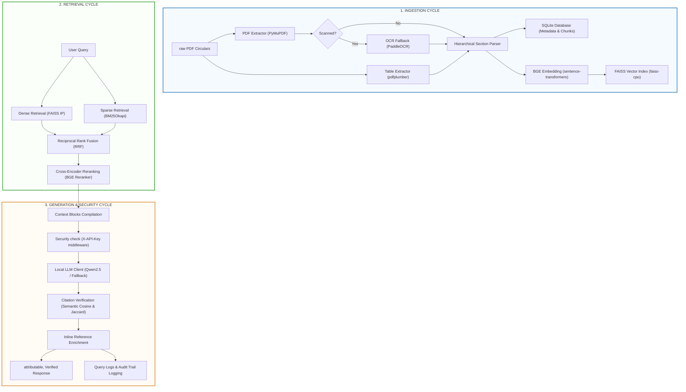

# RBI Regulatory RAG Pipeline – Deep Technical Architecture & Explainer

This document provides a comprehensive, first-principles explanation of the **Reserve Bank of India (RBI) Regulatory RAG System**. It outlines the role of every library, the mathematics of the algorithms, and the lifecycle of ingestion, retrieval, generation, verification, and security compliance.

---

## 1. High-Level Architectural Flow

The RAG pipeline is divided into three core cycles—**Ingestion**, **Retrieval**, and **Generation**—complemented by a static/runtime **Security Control** layer.



---

## 2. Exhaustive Library Matrix

The system operates strictly on low-level libraries without orchestrator layers (such as LangChain or LlamaIndex) to maintain execution visibility, speed, and safety.

| Library | Version / Class | Core Purpose in Pipeline | ISO 27001 Security Mapping |
| :--- | :--- | :--- | :--- |
| **`PyMuPDF` (`fitz`)** | `1.24.x` | High-speed PDF text extraction, layout parsing, and page rasterization for scanned files. | Secure buffer parsing |
| **`pdfplumber`** | `0.11.x` | Tabular cell-boundary detection. Extracts grid matrices and formats tables into Markdown. | Prevent document layout bypass |
| **`PaddleOCR`** | `2.7.x` | Deep OCR framework. Rasterizes scanned PDFs to PIL images, converts to NumPy arrays, and runs direction-aware OCR. | Automated input fallback |
| **`sqlite3`** | `Built-in` | Standard relational database. Stores document metadata, chunk text, audit log trails, and semantic caching. | A.8.15 Audit Logging, SQLi Protection |
| **`rank-bm25`** | `BM25Okapi` | Implements the BM25 lexical keyword matching algorithm on alphanumeric tokens. | Fast lexical retrieval |
| **`sentence-transformers`** | `SentenceTransformer` | Runs the `BAAI/bge-small-en-v1.5` model to generate 384-dimension semantic vectors. | A.8.3 Input Validation (length control) |
| **`faiss-cpu`** | `IndexFlatIP` | Performs highly parallelized Inner Product (IP) calculations to execute exact Cosine similarity lookups. | Dense retrieval vector database |
| **`sentence-transformers`** | `CrossEncoder` | Runs `BAAI/bge-reranker-base` for full self-attention reranking of query-context sequences. | Semantic sequence alignment |
| **`fastapi` / `uvicorn`** | `0.110.x` | Exposes REST endpoints, registers security middlewares, checks CORS, and handles startup events. | A.8.2 Access Control, A.8.20 Network Security |
| **`pydantic`** | `2.6.x` | Validates API schemas. Enforces strict type boundaries and maximum character length constraints. | A.8.3 Input Sanitization & DoS protection |

---

## 3. The Ingestion Cycle Under the Hood

### Step 1: Text & Table Extraction
* **Standard PDF**: The ingestion script opens the PDF via `fitz`. It extracts text page-by-page. Simultaneously, `pdfplumber` scans the page for tabular boundaries. If a table is found, its bounding box contents are formatted into Markdown (e.g. `| Sector | Limit |`) and injected into the text stream, overriding unformatted table text.
* **Scanned PDF (OCR)**: If a PDF page yields `0` text characters, the system rasters the page using PyMuPDF to a high-resolution PNG byte stream. `PIL` converts the bytes to an RGB Image, and `NumPy` transforms it into a float matrix. `PaddleOCR` executes angle-aware OCR (`use_angle_cls=True`), outputting verified text segments.

### Step 2: Document Name Salutation Heuristics
Rather than trusting the PDF filename (which is often generic, e.g., `34MD27062019.pdf`), the system searches the first 40 lines of the first page for recipient salutations (e.g., `Madam / Dear Sir,`). 
* The lines immediately following the salutation contain the official circular subject.
* The system isolates these lines and concatenates them to form a clean, human-readable document name (e.g., *“Priority Sector Lending - Targets and Classification”*).

### Step 3: Hierarchical Chunking & Linkage
A custom section-aware parser scans the document sequence:
* It detects section headers (e.g. `Chapter I`, `Section 3.2`, `Q 1.`) using standard regex patterns.
* Chunks are separated at section boundaries to prevent splitting a regulation across chunks.
* Subsections are programmatically linked to their parent sections using a `parent_chunk_id` foreign key.
* The parsed chunks and metadata are inserted into SQLite (`documents` and `chunks` tables).

---

## 4. The Dual Retrieval & Fusion Cycle

Retrieval combines keyword accuracy (Sparse) and conceptual match (Dense) in parallel:

```
[User Query]
    │
    ├──► Tokenizer ──► BM25Okapi Index ──────────────────► [Top 50 Sparse List] ──┐
    │                                                                             ▼
    └──► BGE Embedding ──► FAISS Index (IndexFlatIP) ────► [Top 50 Dense List]  ──┼──► Reciprocal Rank Fusion (RRF)
                                                                                  │
                                                                                  ▼
                                                                           [Top 15 merged]
                                                                                  │
                                                                                  ▼
                                                                           Cross-Encoder
                                                                                  │
                                                                                  ▼
                                                                            [Top 5 Reranked]
```

### Step 1: Sparse Retrieval (BM25)
* **Algorithm**: The query is tokenized into a lowercase word list. The system scores every document in the corpus using the **BM25Okapi** algorithm:
  $$Score(D, Q) = \sum_{i=1}^{n} IDF(q_i) \cdot \frac{f(q_i, D) \cdot (k_1 + 1)}{f(q_i, D) + k_1 \cdot \left(1 - b + b \cdot \frac{|D|}{avgdl}\right)}$$
  Where $f(q_i, D)$ is the term frequency in document $D$, $|D|$ is the length of $D$ in words, $avgdl$ is the average document length, and $k_1$ and $b$ are tuning parameters.
* **Output**: Top 50 chunks sorted by lexical relevance.

### Step 2: Dense Retrieval (FAISS Inner Product)
* **Instruction Prefixing**: The query is prepended with `"Represent this question for searching relevant passages: "` (required by BGE).
* **Embedding**: The sentence-transformer generates a 384-dimension vector.
* **FAISS Search**: The vector is searched against `faiss_index.index` using exact inner product matching (`IndexFlatIP`). Since all document vectors were normalized during indexing, the inner product is mathematically identical to **Cosine Similarity**:
  $$CosineSimilarity(u, v) = \frac{u \cdot v}{\|u\| \|v\|} = u \cdot v \quad (\text{when } \|u\| = \|v\| = 1)$$
* **Output**: Top 50 chunks sorted by semantic similarity.

### Step 3: Reciprocal Rank Fusion (RRF)
To combine the different scoring scales of BM25 (arbitrary floats) and FAISS (0.0 to 1.0 cosines), the system merges the lists by rank using RRF:
$$RRF\_Score(d \in D) = \sum_{m \in M} \frac{1}{k + r_m(d)}$$
Where $M$ is the set of retrievers (BM25 and FAISS), $r_m(d)$ is the rank of document $d$ in retriever $m$, and $k$ is a smoothing constant (set to `60`).
* The top **15 chunks** with the highest RRF scores are retained.

### Step 4: Cross-Encoder Reranking
Bi-encoders (FAISS and BM25) embed queries and documents independently. To compute exact token-level attention, we concatenate the strings: `[Query, Chunk Text]` and pass them to the Cross-Encoder (`bge-reranker-base`).
* The cross-encoder runs full self-attention across the combined sequence, calculating a highly accurate relevance score.
* The system re-sorts the candidates and selects the **Top 5 chunks** to populate the LLM context window.

---

## 5. The Generation & Security Cycle

### Step 1: Secure Request Filtering (ISO 27001 Middlewares)
Before processing the query:
1. **API Authentication**: The `X-API-Key` header is checked. It is hashed via SHA256 and compared to the user/admin key hashes. If invalid, the request is terminated with `401 Unauthorized` or `403 Forbidden`.
2. **CORS & Headers**: Strict CORS filters check the client origin. Security headers (`X-Frame-Options`, `X-Content-Type-Options`) are injected.
3. **Input Validation**: The request query is audited. If its length exceeds 1000 characters, it is rejected with `422 Unprocessable Entity` to prevent DoS.

### Step 2: LLM Synthesis (JSON Grammar)
The top context chunks are formatted as XML context blocks and sent to the LLM (Qwen2.5-7B) with instructions to output a strict JSON structure:
* `response`: A detailed narrative answer where **every single sentence** is followed by a citation tag corresponding to the context block index (e.g. `[1]`, `[2]`).
* `citations`: A list of mappings indicating the statement, tag, and context block index.

### Step 3: Dual Citation Verification Engine
To eliminate hallucinations, the system cross-references each LLM statement against its cited context chunk:
1. **Lexical Jaccard Overlap**: Calculates the intersection of words between the LLM statement and the source chunk:
   $$Jaccard(S, C) = \frac{|Tokens(S) \cap Tokens(C)|}{|Tokens(S) \cup Tokens(C)|}$$
2. **Semantic Cosine Match**: Generates embeddings for both the statement and the context chunk, calculating their vector cosine similarity.
3. **Verdict**: If the cosine similarity $\ge 0.70$ OR Jaccard overlap $\ge 0.40$, the citation is marked as **VERIFIED**. Otherwise, a **HALLUCINATION WARNING** is logged and attached to the response.

### Step 4: Inline Reference Enrichment
To satisfy strict verification requirements, the system processes the generated response text and replaces inline citation tags (e.g., `[1]`) with detailed source metadata, writing:
`[1: filename, Page X, Section Y, Ref Z]`
This ensures the final output contains detailed inline references for every claim.

### Step 5: Audit Trail
The query, execution times, detailed response JSON, and client identity hash are logged to SQLite (`query_logs` table) to maintain a complete audit trail.
If any system error occurs during execution, the global exception handler catches it, logs the detailed traceback to secure server files, and returns a clean, generic error to the client, preventing database structure leakage.
